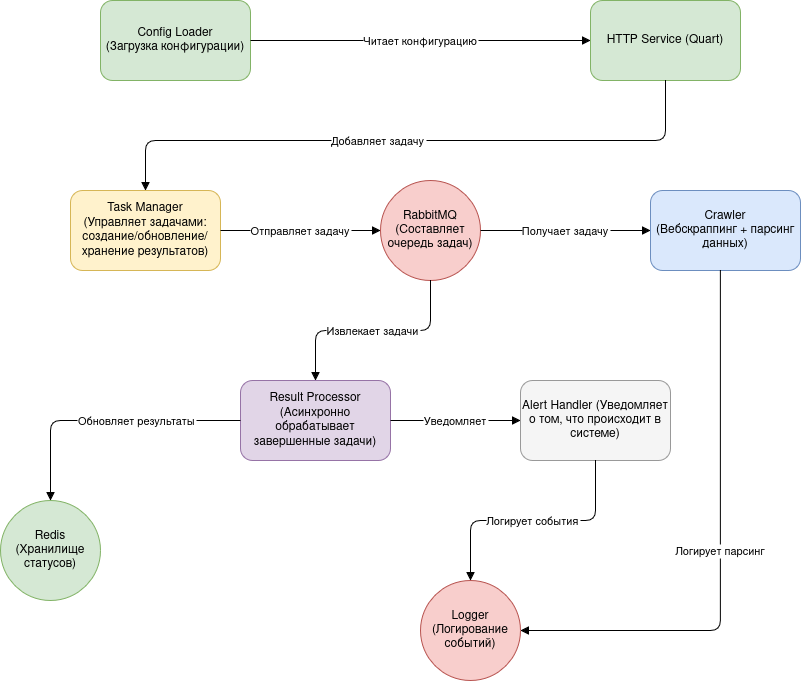

# TikTok Ad Library Crawler

## Описание проекта
TikTok Ad Library Crawler — это асинхронный сервис, предназначенный для парсинга данных с сайта [TikTok Ad Library](https://library.tiktok.com/). Сервис обеспечивает выполнение задач с использованием очередей RabbitMQ, хранения и обработки данных через Redis, а также уведомления пользователей о результатах с помощью различных каналов (например, Telegram).

## Основные возможности
- **POST /crawl**: Добавление задачи в очередь RabbitMQ для обработки.
- **GET /result/{id}**: Получение статуса задачи и ее результата.
- Асинхронный парсинг данных с поддержкой ключевых слов для фильтрации.
- Уведомления о завершении задачи через Telegram, систему логирования и другие интеграции.

---

## Структура проекта

### Структурная схема приложения



### HTTP-сервис
**Модули:** `api/app.py`, `api/routes.py`

- **Описание:** Обеспечивает доступ к основным функциональным возможностям сервиса через HTTP API.
- **За что отвечает:**
  - Эндпоинт `POST /crawl` принимает задачи для обработки.
  - Эндпоинт `GET /result/{id}` предоставляет статус и результат задачи.
- **Как работает:**
  - Использует `Quart` для асинхронного взаимодействия с клиентами.
  - Подключается к Redis для работы с данными о задачах.
- **Взаимодействие:**
  - Использует `TaskManager` для управления задачами.
  - Логирует ошибки и события через `Logger`.
  - Обрабатывает исключения с помощью `ExceptionHandler`.

### TaskManager
**Модули:** `core/task_manager.py`

- **Описание:** Управляет созданием задач и их статусами.
- **За что отвечает:**
  - Добавляет задачи в RabbitMQ.
  - Хранит и обновляет статусы задач в Redis.
- **Как работает:**
  - Использует `aioredis` для работы с Redis.
  - Использует `aio_pika` для взаимодействия с RabbitMQ.
- **Взаимодействие:**
  - Работает с `RabbitMQPublisher` и `RedisManager` для передачи и хранения данных.

### RabbitMQPublisher
**Модули:** `core/rabbit_publisher.py`

- **Описание:** Обеспечивает публикацию задач и результатов в очереди RabbitMQ.
- **За что отвечает:**
  - Публикация задач в очередь `crawler.task`.
  - Публикация результатов в очередь `crawler.result`.
- **Как работает:**
  - Подключается к RabbitMQ через `aio_pika`.
- **Взаимодействие:**
  - Используется `TaskManager` и `ResultProcessor`.

### Crawler
**Модули:** `crawler/crawler.py`, `crawler/parser.py`

- **Описание:** Выполняет основную задачу парсинга данных с TikTok Ad Library.
- **За что отвечает:**
  - Обрабатывает задачи из очереди `crawler.task`.
  - Парсит данные с использованием Selenium и BeautifulSoup.
  - Отправляет результаты в очередь `crawler.result`.
- **Как работает:**
  - Использует Selenium для работы с динамическими страницами.
- **Взаимодействие:**
  - Получает задачи из RabbitMQ.
  - Отправляет результаты через `RabbitMQPublisher`.

### ResultProcessor
**Модули:** `core/result_processor.py`

- **Описание:** Обрабатывает результаты задач.
- **За что отвечает:**
  - Извлекает завершенные задачи из RabbitMQ.
  - Обновляет данные в Redis.
  - Уведомляет пользователей о завершении задач через `AlertHandler`.
- **Как работает:**
  - Использует `RedisManager` для обновления данных.
- **Взаимодействие:**
  - Работает с `RabbitMQPublisher` и `AlertHandler`.

### RedisManager
**Модули:** `core/redis_manager.py`

- **Описание:** Управляет взаимодействием с Redis.
- **За что отвечает:**
  - Хранит статусы и результаты задач.
- **Как работает:**
  - Использует `aioredis` для асинхронного взаимодействия.
- **Взаимодействие:**
  - Используется всеми основными модулями для управления состоянием задач.

### AlertHandler
**Модули:** `modules/alert_handler/alert_handler.py`, `modules/alert_handler/alert_destination.py`

- **Описание:** Уведомляет пользователей о завершении задач или ошибках.
- **За что отвечает:**
  - Отправляет уведомления в Telegram, системы мониторинга и логи.
- **Как работает:**
  - Использует REST API Telegram для отправки сообщений.
- **Взаимодействие:**
  - Интегрирован с `ResultProcessor`.

### Logger
**Модули:** `modules/logger/logger.py`, `modules/logger/log_levels.py`

- **Описание:** Обеспечивает универсальный механизм логирования.
- **За что отвечает:**
  - Логирование событий, ошибок и информации.
- **Как работает:**
  - Загружает конфигурацию из YAML-файлов.
  - Поддерживает уровни логирования (INFO, DEBUG, ERROR и т. д.).
- **Взаимодействие:**
  - Используется всеми модулями для логирования.

### ExceptionHandler
**Модули:** `modules/exception_handler/exception_handler.py`

- **Описание:** Централизованная обработка исключений.
- **За что отвечает:**
  - Обрабатывает исключения, формирует унифицированный ответ об ошибке.
- **Как работает:**
  - Логирует исключения через `Logger`.
- **Взаимодействие:**
  - Интегрирован с HTTP-сервисом и другими модулями.

---

## Структура классов


## Диаграмма модулей и их взаимодействия в системе


> Были получены при помощи команды:
> ```bash
> pyreverse -o png SominAI .
> ```
> Но для этого сначала нужно скачать `pylint`:
> ```bash
> pip install pylint
> ```

---

## Точные* зависимости и их версии

```
aio_pika==9.5.4
beautifulsoup4==4.12.3
pytest==8.3.4
PyYAML==6.0.1
PyYAML==6.0.2
quart==0.20.0
redis==5.2.1
Requests==2.32.3
selenium==4.27.1
```

> Были получены при помощи утилиты `pipreqs`:
> ```bash
> pipreqs .
> ```

---

## Технологический стек проекта

Проект построен с использованием современного стека технологий, специально адаптированных для обеспечения высокой производительности, масштабируемости и эффективности обработки задач в асинхронном окружении. Используемые технологии выбраны с учетом их совместимости, гибкости и поддержки асинхронного программирования.

- **Python 3.12+**: Python версии 3.12 и выше был выбран как основной язык разработки благодаря его обширной экосистеме библиотек, поддержке асинхронного программирования и способности быстро реализовывать сложные алгоритмы. Поддержка новых возможностей языка, таких как улучшенный синтаксис для работы с корутинами и улучшенная производительность, делает Python 3.12 идеальным выбором для высоконагруженных веб-сервисов и задач обработки данных.
- **Quart**: Quart — это асинхронный веб-фреймворк, построенный на основе API Flask, но с полной поддержкой асинхронного программирования. Использование Quart в проекте позволяет:
  1. Обработку больших объемов одновременных запросов: благодаря асинхронной модели I/O сервер эффективно масштабируется.
  2. Совместимость с существующими библиотеками Flask: разработчики могут использовать знакомые концепции Flask, сохраняя при этом преимущества асинхронности.
  3. Асинхронные обработчики: такие обработчики интегрируются с aioredis и aio_pika, что позволяет напрямую взаимодействовать с RabbitMQ и Redis.
- **RabbitMQ**: RabbitMQ — это брокер сообщений, используемый в проекте для обработки задач через очереди. Его преимущества включают:
  1. Поддержка AMQP-протокола: RabbitMQ обеспечивает стандартный способ доставки сообщений.
  2. Гарантии доставки: Использование подтверждений сообщений ([acknowledgment](https://www.ibm.com/docs/en/imdm/14.0?topic=topics-acknowledgment-message-configuration)) и механизмов повторной попытки публикации ([retry](https://medium.com/nuances-of-programming/%D0%BC%D0%B5%D1%85%D0%B0%D0%BD%D0%B8%D0%B7%D0%BC-%D0%BF%D0%BE%D0%B2%D1%82%D0%BE%D1%80%D0%BD%D1%8B%D1%85-%D0%BF%D0%BE%D0%BF%D1%8B%D1%82%D0%BE%D0%BA-%D0%B2-spring-boot-retryable-%D0%B8-recover-51de58f4e981)) исключает потерю задач в очереди.
  3. Масштабируемость: возможность работы с распределенными очередями обеспечивает устойчивость системы под высокой нагрузкой.
Для взаимодействия с RabbitMQ используется библиотека `aio_pika`, которая поддерживает асинхронный API и позволяет интегрировать обработку сообщений в рамках общего асинхронного цикла программы.
RabbitMQ **в проекте используется для**:
  - Добавления задач в очередь (crawler.task).
  - Отправки результатов после обработки задач (crawler.result).
- **Redis**: Xранилище данных в памяти, использующееся для хранения информации о статусах задач. Его ключевые преимущества:
  1. Высокая скорость доступа: Redis работает в оперативной памяти, обеспечивая минимальную задержку.
  2. Поддержка структур данных: такие структуры, как строки, хэши и списки, позволяют гибко организовывать данные о задачах.
  3. Надежность: возможность работы с репликацией и персистентностью.
Библиотека `aioredis` используется для взаимодействия с Redis в асинхронном режиме. Это позволяет обновлять статусы задач без блокировки основного потока выполнения.
Redis **в проекте используется для**:
  - Сохранения статусов задач (например, queued, in_progress, completed).
  - Извлечения информации о задаче по уникальному ID.
- **Selenium**: Применяется для получения HTML-кода страниц, которые загружаются динамически с помощью JavaScript. Это особенно важно, так как TikTok Library рендерит контент на стороне клиента.
Selenium **в проекте используется для**:
  - Получения полного HTML-кода страницы TikTok Library.
  - Поддержки взаимодействия с динамическими элементами, такими как выпадающие списки и кнопки.
- **aioredis, aio_pika**: Асинхронные библиотеки для работы с Redis и RabbitMQ.

---

## Связь компонентов

Все технологии в проекте связаны между собой через общую асинхронную архитектуру:

- Quart взаимодействует с пользователем через HTTP API. Запросы обрабатываются асинхронно и добавляются в RabbitMQ.
- RabbitMQ используется как транспортный слой для передачи задач от API к обработчику (Crawler).
- Redis сохраняет информацию о статусах задач, которая извлекается по запросу через API.
- Selenium парсит динамические страницы и передает данные для обработки.
- aioredis и aio_pika обеспечивают асинхронное взаимодействие с Redis и RabbitMQ, минимизируя задержки.

---

## Установка и запуск
1. Клонируйте репозиторий:
   ```bash
   git clone <URL>
   cd TikTok-Ad-Library-Crawler
   ```
2. Установите зависимости:
   ```bash
   pip install -r requirements.txt
   ```
3. Запустите сервис:
   ```bash
   python main.py
   ```

---

## Примеры

### Команды для проверки работы сервиса

> Также, эти команды можете найти в файле `test_commands.txt` в корневой директории репозитория.

```bash
curl -X POST http://localhost:8000/crawl -H "Content-Type: application/json" -d '{"keyword": "test"}'
```

После отправки POST-запроса программа выдаст специальный идентификато **uuid4**, его вносим далее в эту команду:

```bash
curl -X GET http://localhost:8000/result/<uuid4>
```

#### 1. Запуск сервисов через docker compose


#### 2. Загрузка сервисов

> В данном случае RabbitMQ


#### 3. Запуск приложения и обработка задачи


> На выделенном фрагменте можно увидеть URL-адрес с которого был осуществлен кроулинг и ID задачи, также, ID задачи будет отображено на втором терминале, где можно выполнить POST-запрос при помощи утилиты командной строки `curl`.

Результат можно увидеть в этом же терминале или написав команду:

```bash
curl http://0.0.0.0:8000/result/<task_id>
```


Или можно зайти в любой браузер и в адресной строке прописать URL `http://0.0.0.0:8000/result/<task_id>`:


#### 4. Отправка POST-запроса через 2-й терминал


### *Команды, использованные в примере

```bash
docker compose build
docker compose up
```

> Для останова и удаления контейнера:
> ```bash
> docker compose down
> ```

## Документация

Документация была сгенерирована с помощью `doxygen`. Ее можно посмотреть как в браузере в html формате, так и в едином pdf файле: `docs/SominAI_doc.pdf`. Для того, чтобы просмотреть в браузере, требуется открыть файл `docs/html/index.html` в браузере.
